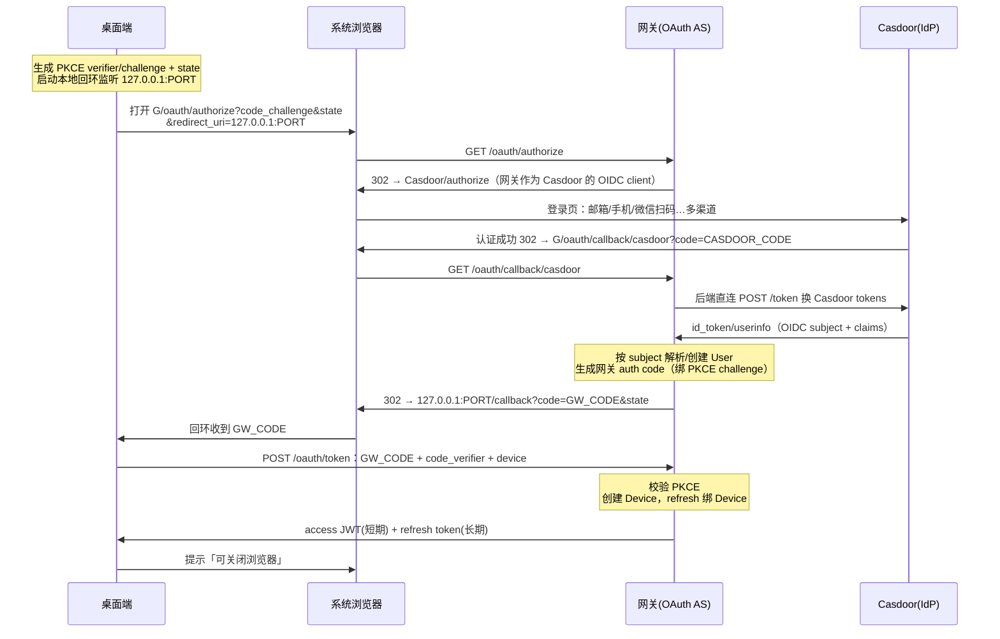
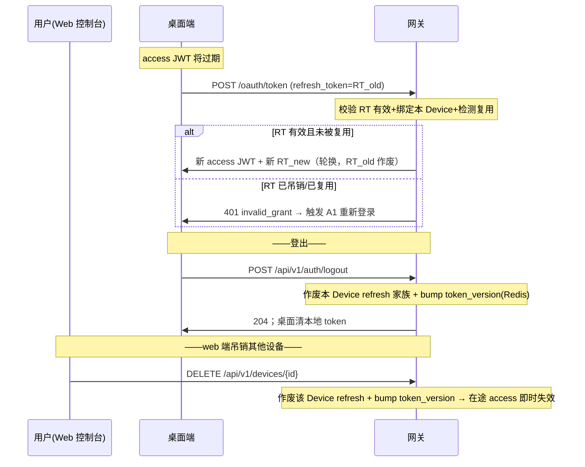

# 认证域流程（A1–A3）

桌面端 ↔ 网关 的认证交互。相关决策见 ADR-0002（Casdoor 作 IdP）、ADR-0003（浏览器中转 PKCE + Device）、ADR-0009（网关作 OAuth 授权服务器）、ADR-0010（即时吊销）。

**接口约定**
- OAuth 端点（`/oauth/*`）遵循 OAuth 2.0 惯例：JSON 请求体，失败返回 `{ "error": "...", "error_description": "..." }`。
- 管理端点（`/api/v1/*`）位于 `middleware.JWTAuth()` 之后，失败返回**真实 HTTP 状态码** + `ApiError{ "error": "...", "message": "..." }`，成功直接返回 JSON 实体或 `204`（不使用 200-信封）。全局错误矩阵见端点总表。

**access JWT 载荷（claims）**：`sub`（用户 ID）、`device_id`、`token_version`、`exp`（默认 TTL 30 分钟）。
**refresh token**：不透明字符串，绑定 `device_id`，每次使用轮换，归属同一个「轮换家族」。**寿命滑动续期**——每次刷新重置有效期，空闲 60 天未刷新即过期。
**客户端类型**：`vulture-desktop` 为**公共客户端**（无 `client_secret`），强制 PKCE（`S256`）。

---

## A1 · 登录授权



**关键决策**：网关作 OAuth AS + Casdoor 上游（ADR-0009）· 本地回环 `127.0.0.1` 回调（RFC 8252）· 桌面上报 Device 元信息、网关签发 `device_id`。

### 端点

**`GET /oauth/authorize`** —— 浏览器入口，返回 302 跳转到 Casdoor。

| 查询参数 | 必填 | 说明 |
|---|---|---|
| `response_type` | ✓ | 固定 `code` |
| `client_id` | ✓ | `vulture-desktop` |
| `redirect_uri` | ✓ | `http://127.0.0.1:<port>/callback` 或 `http://[::1]:<port>/callback`；仅校验 host∈{`127.0.0.1`,`[::1]`} + path=`/callback`，**端口任意**（ephemeral、免预注册，RFC 8252） |
| `code_challenge` | ✓ | PKCE S256 |
| `code_challenge_method` | ✓ | `S256` |
| `state` | ✓ | 防 CSRF，原样回传给桌面端 |
| `scope` | – | 如 `openid profile` |

网关将 `{state, code_challenge, redirect_uri}` 暂存服务端，随后 `302` 跳转到 Casdoor 的 authorize 地址（携带网关自己的回调与关联 state）。

**`GET /oauth/callback/casdoor`** —— Casdoor 的回调目标（服务端内部）。
查询参数：`code`（Casdoor 授权码）、`state`（关联 state）。网关后端直连用该 code 换 Casdoor token，读取 OIDC subject，解析/创建 User，签发一次性的网关授权码（GW_CODE，TTL 60s、单次使用），并 `302` 跳回桌面端回环地址 `redirect_uri?code=GW_CODE&state=<原始 state>`。

**失败回跳契约：**
- **`state` 有效（redirect_uri 已知）下的失败**——用户在 Casdoor 取消、网关↔Casdoor 换 token 失败、subject 解析失败等 ⇒ `302` 跳回 `redirect_uri?error=<code>&error_description=<...>&state=<原始 state>`（RFC 6749 错误响应；`access_denied`=用户取消，`server_error`=网关↔Casdoor 交互失败）。桌面端回环收到 `error` ⇒ 判登录失败 → 提示并关闭本地 server。
- **`state` 失效/非法**（网关已无 redirect_uri，无法回跳）⇒ 网关渲染**极简浏览器错误页**，不回跳。
- **桌面端要求**：回环 server 设超时（建议 5min）——期间无任何回调（如浏览器被直接关闭）即放弃并提示重试，防止永久挂死。

**`POST /oauth/token`**（grant_type=`authorization_code`）—— 最终换取令牌。
```json
{
  "grant_type": "authorization_code",
  "code": "GW_CODE",
  "code_verifier": "<pkce verifier>",
  "client_id": "vulture-desktop",
  "redirect_uri": "http://127.0.0.1:PORT/callback",
  "device": { "name": "Pan's MacBook", "os": "macOS 15.5", "app_version": "1.2.0" }
}
```
→ `200`：
```json
{
  "access_token": "<JWT>",
  "token_type": "Bearer",
  "expires_in": 1800,
  "refresh_token": "<opaque>",
  "device_id": "dev_xxxx"
}
```
错误：`400 {"error":"invalid_grant"}`（授权码过期/未知、PKCE 不匹配、redirect_uri 不匹配）。

---

## A2 · Token 刷新 ＆ A3 · 登出 / 吊销



**关键决策**：refresh 轮换 + 复用检测（判盗即作废整个家族，含 60s 幂等宽限窗）· 通过 Redis 中的 `token_version` 实现有状态即时吊销（ADR-0010）。

### 端点

**`POST /oauth/token`**（grant_type=`refresh_token`）
```json
{ "grant_type": "refresh_token", "refresh_token": "RT_old", "client_id": "vulture-desktop" }
```
→ `200`，结构同 A1（返回新的 `access_token` + 轮换后的 `refresh_token`）。

**并发容错（ADR-0010 配套）：**
- **幂等宽限窗 60s**：`RT_old` 被轮换后 60s 内再次出示 `RT_old`，**不**判复用，而是**重放**上一次已签发的同一对 `(access_token, RT_new)`（不再轮换、不作废家族）——容忍网络重试与多请求竞态。
- **超出宽限窗**后再出示已被取代的 `RT_old` ⇒ 判定复用/失窃 ⇒ 作废整个轮换家族 ⇒ `401 {"error":"invalid_grant"}` → 触发 A1 重新登录。
- **桌面端要求（必须）**：刷新必须 **single-flight**——并发请求只发起一次刷新，其余等待并共享同一结果，不得各自拿 `RT_old` 重复刷新。

**`POST /api/v1/auth/logout`** —— 吊销当前调用方 Device。
- **有效 access**：带 `Authorization: Bearer`，吊销该 access 对应 Device。
- **access 已失效**：改在 body 带 `{ "refresh_token": "RT" }`，吊销该 RT 绑定的 Device 家族（兜底——避免残留一个服务端仍有效的 refresh 家族）。
→ `204 No Content`。两路均 bump 该 Device 的 `token_version`（即时生效）。

**`GET /api/v1/devices`**（Bearer）—— 列出该 User 已授权的 Device。
→ `200`，直接返回数组：
```json
[
  { "device_id": "dev_xxx", "name": "Pan's MacBook", "os": "macOS 15.5",
    "app_version": "1.2.0", "created_at": 1733700000, "last_active_at": 1733786400,
    "current": true }
]
```

> `last_active_at`：在 **token 刷新时**更新（≈30min 粒度，反映该 Device 最近活跃；空闲即停止滑动）。

**`DELETE /api/v1/devices/{device_id}`**（Bearer）—— 吊销指定 Device。
→ `204 No Content`。bump 目标 Device 的 `token_version` ⇒ 该设备即时登出。

---

## 横切关注点：`JWTAuth` 中间件

每个 **Bearer 保护端点**（`/api/v1/*`、LLM 的 `/v1/*`、制品下载等所有需登录端点）：校验 JWT 签名 → 取出 `device_id` + `token_version` → 与 Redis 中 `device:{device_id}:token_version` 比对。不匹配或已吊销 ⇒ `401`（`/api/v1/*` 与下载返回 `ApiError`；`/v1/*` 返回 OpenAI error 体）。这一步 O(1) 比对即是「即时吊销」的实现（ADR-0010）。`/api/v1/bootstrap`、`/api/v1/app/latest` 是公开例外（见 bootstrap.md / distribution.md）。

## Park / 待定

- **每用户最大 Device 数**（如 5 台）—— 与 Plan 权益挂钩，待产品文档定夺。
