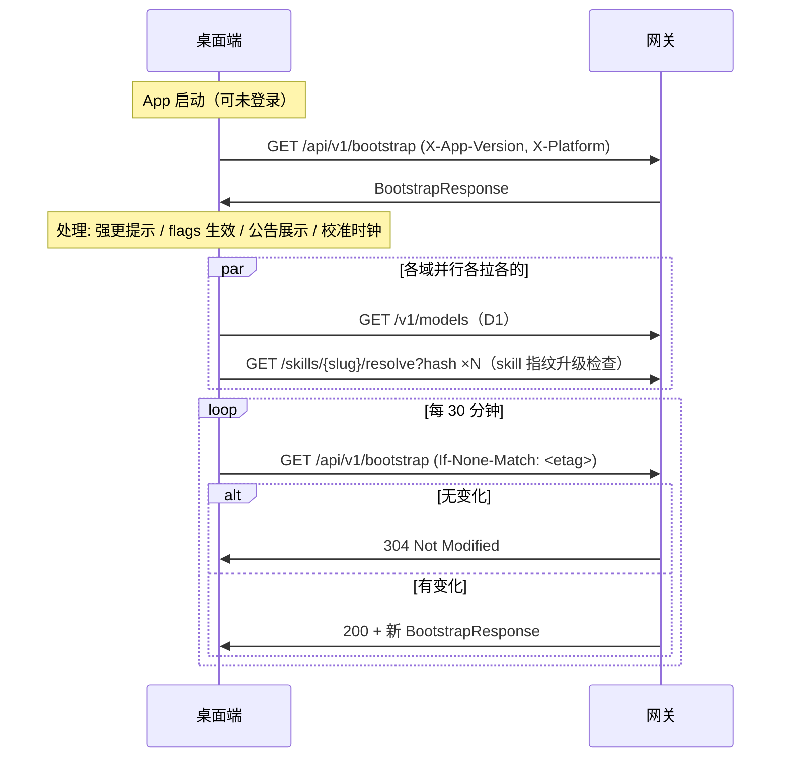

# 启动引导流程（F2 Bootstrap）—— 桌面端对接方案

桌面端启动时拉取「开工信息」的轻量聚合端点。

**定位（已定：轻量聚合）**：`GET /api/v1/bootstrap` 只返回**启动必须、且无归属域**的信息——网关版本、服务端时间、feature flags、运营公告、App 更新摘要。**不搬运**已有域的数据：模型列表仍走 `/v1/models`（llm-proxy.md）、技能/插件升级仍走 `/resolve`（skill-plugin-lifecycle.md）。各域契约变化不影响 bootstrap。

---

## 1. 时序与刷新策略



**刷新策略（已定：启动 + 定时轮询）**：
- 启动拉一次；之后每 **30 分钟**轮询一次
- 轮询带 `If-None-Match`（上次响应的 `ETag`），无变化时 `304` 省流量
- **ETag 按 `(channel, X-App-Version, X-Platform)` 分桶**：响应随这三者变化，切换任一维度旧 ETag 不会误命中 `304`
- flags / 公告 / 强更标记借此准实时生效，无需长连接

---

## 2. 端点契约

**`GET /api/v1/bootstrap`** —— **公开端点，无需登录**（启动时可能尚未登录；内容均非用户态）

请求头：

| 头 | 必填 | 说明 |
|---|---|---|
| `X-App-Version` | ✓ | 当前桌面 App 版本（用于计算 app_update 与强更标记） |
| `X-Platform` | ✓ | 平台/架构（如 `darwin-arm64`，用于选对安装包） |
| `If-None-Match` | – | 轮询时带上次 `ETag`，无变化得 304 |

Query：`channel`（可选，`stable`/`beta`，默认 `stable`）

响应（`200`，带 `ETag` 头）：

```ts
interface BootstrapResponse {
  server_time: number;           // 服务端当前时间（Unix 秒）。用于校准本地钟——
                                 // 窗口恢复时间(X-Window-*-Reset)等都按服务端时间算
  gateway_version: string;       // 网关版本（报障/兼容判断用）
  min_app_version?: string;      // 最低建议 App 版本；当前版本低于它 ⇒ 视为强更提示
                                 // （仅提示引导，不硬卡——沿用 F1 决策）
  app_update: {                  // App 更新摘要；已是最新则为 null
    latest_version: string;      // 最新版本号
    mandatory: boolean;          // 是否强更（仅提示标记）
    download_url: string;        // 安装包下载地址（R2 预签名/公开 URL）
    checksum: string;            // 安装包 SHA256（"sha256:..."），下载后校验
    size: number;                // 安装包字节数
    release_notes: string;       // 更新说明
  } | null;
  feature_flags: Record<string, boolean | string | number>;
                                 // 功能开关：key→值。如 {"mcp_enabled": false,
                                 // "max_upload_mb": 50}。未知 key 桌面端忽略
  notices: {                     // 运营公告（可多条；空数组=无公告）
    id: string;                  // 公告唯一 ID（桌面端据此做"已读不再弹"）
    level: "info" | "warning" | "critical";  // 级别：横幅 / 醒目 / 强弹窗
    title: string;               // 标题
    content: string;             // 正文（纯文本或 markdown）
    starts_at?: number;          // 生效时间（Unix 秒，可选）
    ends_at?: number;            // 失效时间（Unix 秒，过期不展示）
    url?: string;                // 详情链接（可选）
  }[];
}
```

示例：

```json
{
  "server_time": 1765430400,
  "gateway_version": "1.4.2",
  "min_app_version": "1.2.0",
  "app_update": {
    "latest_version": "1.3.0", "mandatory": false,
    "download_url": "https://r2.../VultureSetup-1.3.0.dmg",
    "checksum": "sha256:abc...", "size": 48000000, "release_notes": "..."
  },
  "feature_flags": { "mcp_enabled": false },
  "notices": [
    { "id": "ntc_001", "level": "info", "title": "维护通知",
      "content": "6 月 15 日 02:00–04:00 服务维护。", "ends_at": 1765843200 }
  ]
}
```

---

## 2b. 已知 feature_flags 注册表

`feature_flags` 是开放 map，但桌面端要**主动消费**的 flag 必须双方登记 key/类型/默认值（未知 key 一律忽略）。v1 已登记：

| key | 类型 | 默认值 | 含义 |
|---|---|---|---|
| `mcp_enabled` | bool | `false` | 是否启用 E 域 MCP 入口（暂缓，留扩展位） |
| `max_upload_mb` | number | `25` | `/v1/*` 请求体上限（MB）；桌面端据此预检多模态附件大小，与网关 `413` 一致 |

新增 flag 必须在此表登记后，桌面端才消费。

---

## 3. 桌面端处理规则

1. **强更判断**：`X-App-Version < min_app_version` 或 `app_update.mandatory=true` ⇒ 启动时强提示引导更新（不硬卡，沿用 F1）。
2. **时钟校准**：用 `server_time` 与本地时间求偏移量，后续展示「窗口恢复时间」等服务端时间戳时套用。
3. **flags**：未知 key 一律忽略（向前兼容）；flag 缺失按桌面端内置默认值。
4. **公告**：按 `level` 决定展示形态；`id` 记入本地已读集合；过了 `ends_at` 不展示。
5. **失败容忍**：bootstrap 拉取失败**不阻塞启动**——用上次缓存的响应（含 flags/公告），仅 App 更新检查延后到下次轮询。

## 4. 与其他流程的关系

| 信息 | 归属 | bootstrap 角色 |
|---|---|---|
| App 更新 | [distribution.md](./distribution.md)（F1） | bootstrap 内嵌摘要 = 启动时顺带一次 F1 检查；用户手动「检查更新」仍走 `GET /api/v1/app/latest` |
| 模型列表 | [llm-proxy.md](./llm-proxy.md)（D1） | 不含；桌面端启动后自行拉 `/v1/models` |
| 技能/插件升级 | [skill-plugin-lifecycle.md](./skill-plugin-lifecycle.md) | 不含；skill 逐个 `/skills/{slug}/resolve`（指纹），plugin 按版本比较 |
| 登录态 | [auth.md](./auth.md) | bootstrap 不需要登录，先于登录可用 |

## Park / 待定

- feature flags 是否需要**按用户/按 Plan 灰度**（当前全局同值）——若需要，bootstrap 改为登录后带 Bearer 重拉一次个性化版本。等产品需求。
- MCP endpoint 发现（E 域暂缓）——将来可在 bootstrap 加 `mcp` 字段或独立发现端点。
