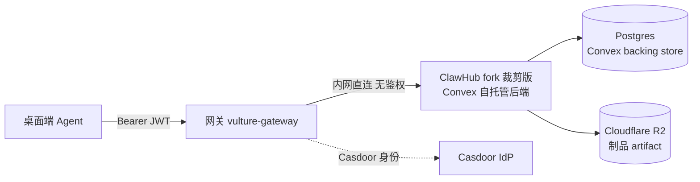

# ClawHub 注册中心整合（后端 / 运维视角）

> 桌面端**对接方案**（完整生命周期 + 交互数据结构）见 [skill-plugin-lifecycle.md](./skill-plugin-lifecycle.md)。本文是注册中心**后端侧**：fork 裁剪范围、自托管中间件、整合风险。决策见 ADR-0006。

注册中心采用「重度 fork + 裁剪」的 ClawHub 取代 nacos。

**已定的整合决策**：① ClawHub **完全去掉身份认证、纯内网访问**，鉴权全部由网关承担；② 制品仓库用 **Cloudflare R2（S3 兼容）**，作自托管 Convex 的 file-storage 后端；③ **保留**安装遥测 telemetry；④ **不做搜索**（向量与关键字均不做），面向 C 端直接展示 skill/plugin **列表**（排序 + 分页 + filter）；⑤ **下载经 `302` 跳短时效存储 URL**，完整性 sha256 由版本详情（`artifact.sha256`）提供、客户端比对（不再走网关完整性头）。

---

## 1. 整合拓扑

- 桌面端只认网关：所有 `/api/v1/skills|plugins|.../resolve|.../download` 经网关鉴权（Casdoor/JWT + Device，见 `auth.md`）后转发给内网 forked ClawHub。
- **ClawHub 自身无鉴权**：去掉 GitHub OAuth / Convex Auth，只接受来自网关的内网调用。
- **制品存储 = R2**：自托管 Convex 的 file-storage 后端配成 Cloudflare R2（S3 兼容）；下载端点 `302` 跳 file-storage 签发的短时效 URL，桌面端直连存储取字节。

---

## 2. 保留 / 裁剪清单

| 保留（注册中心内核） | 裁剪 |
|---|---|
| Convex 数据模型（skills/skillVersions/packages/packageReleases/指纹表…） | GitHub OAuth 身份、账龄门控 |
| v1 HTTP API（search/list/detail/versions/resolve/download/security） | 公开发布（改为 curated/运营内网发布） |
| 指纹更新检测（`/resolve?hash`）+ lockfile/origin | 举报/审核状态机、发布者反滥用、auto-ban |
| semver + tag（latest 服务端权威）+ changelog | 星标/评论、排行榜、souls |
| family：skill / code-plugin / bundle-plugin | 外部 Codex/VirusTotal 扫描 worker（v1 仅留确定性静态扫描） |
| compat 门禁 + Plugin Inspector | **搜索全部移除**（向量 OpenAI embeddings + 关键字均去掉）→ 只展示列表 |
| capability tags、security-verdicts 契约、确定性打包 | Convex Auth / JWT 密钥 / Resend 邮件 |
| 安装遥测 telemetry（保留） | — |

## 3. family 与承载

| family | 是什么 | manifest 位置 | 执行代码 | 承载表 |
|---|---|---|---|---|
| **skill** | 文本能力包：`SKILL.md` + 支持文件 | `SKILL.md` frontmatter（`metadata.openclaw.*`） | 否 | `skills`/`skillVersions` |
| **code-plugin** | 会执行代码的插件包 | `package.json` 的 `openclaw.*` + `openclaw.plugin.json` | 是 | `packages`(code-plugin)/`packageReleases` |
| **bundle-plugin** | 宿主 bundle（codex/claude/cursor） | `openclaw.plugin.json` + bundle marker | 否 | `packages`(bundle-plugin)/`packageReleases` |

v1 **不采用 souls**。

## 4. 自托管所需中间件

| 组件 | 作用 | 备注 |
|------|------|------|
| **Convex 自托管后端**（`convex-backend`, Rust, Docker） | ClawHub 函数运行时 + 响应式 DB 层 | 最重依赖 |
| **Postgres**（Convex 专用库） | 自托管 Convex 的后端存储 | 与网关业务库分开；Convex 支持 PG/MySQL/SQLite |
| **Cloudflare R2（S3 兼容）** | skill/plugin 制品 artifact | 配为 Convex file-storage 后端 |
| **Node 运行时**（Convex Node actions） | 跑 `"use node"` 动作（Plugin Inspector `@openclaw/plugin-inspector`） | plugin 兼容性扫描需要 |
| （可选）Convex Dashboard | 运营查看/管理 | 自托管自带 |
| （可选）管理前端 | curated 发布运营台 | 纯内网 + CLI 发布可不部署 |

**因裁剪而不再需要**：GitHub OAuth、Convex Auth JWT 密钥、GitHub App/Token、OpenAI key（去向量搜索）、Resend 邮件、VirusTotal、外部 Codex 扫描 worker。

## 5. 裁剪适配要点

- **发布身份**：去 GitHub 账龄门控与 OIDC 可信发布；发布者 = 运营，经内网 API/CLI 发布
- **changelog 自动生成**：关掉 LLM 自动生成（去 OpenAI 依赖），要求显式 changelog
- **搜索**：**完全移除**（向量与关键字均不做）；只提供 `GET /skills`、`GET /plugins` 列表（`sort` 排序 + 游标分页 + family/channel/平台 filter）。可一并移除 `skillSearchDigest` 的 search index 与 `GET /search` 端点
- **安全**：去外部 Codex/VT/反滥用 worker 与公开审核状态机；保留确定性静态扫描 + Plugin Inspector + 运营人工 `manualModeration`(approved/quarantined/revoked)

## 6. 仍待跟进（唯一剩余大风险）

**Convex 自托管可行性 + R2 文件存储支持** —— fork 保留 Convex 作后端运行时；需落实 `convex-backend` 自托管 + Postgres backing store，并验证其 file-storage 能否配 **Cloudflare R2（S3 兼容）** 后端。若不支持，回退方案：改 ClawHub 上传/下载路径直连 R2（绕过 Convex file-storage）。

> 裁剪改造的执行用 Claude Code 分阶段进行；删除型阶段采用「就地停用 + 物理删除补丁（`PHYSICAL-DELETE.md`）」，物理删除 + `convex codegen` 合并到 Convex 自托管阶段批量执行。
