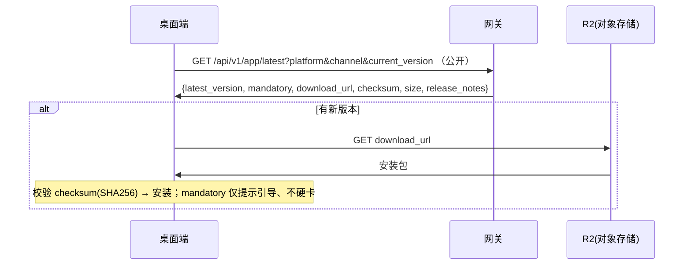

# 宿主 App 自更新流程（F1）

> **Skill/Plugin 的分发与完整生命周期见 [skill-plugin-lifecycle.md](./skill-plugin-lifecycle.md)**（基于 fork 裁剪版 ClawHub，ADR-0006）。原 B1–B3（技能/插件市场浏览·升级检查·下载）已被其取代（指纹更新 `/resolve` + lockfile/origin + ClawHub 端点 + OSS），不再在本文维护。
>
> 本文只负责**桌面端宿主 App 二进制自身的更新**——它不是 skill/plugin/package，不归 ClawHub 管，由网关原生提供。

---

## 范围与边界

- **ClawHub(fork)** 管的是 agent 运行时加载的 **skill / code-plugin / bundle-plugin**。
- **宿主 App 本体**（桌面端 Electron 安装包 `.dmg`/`.exe` 等）是**运行时本身**，不属于 ClawHub 任何 family，由网关**原生端点**提供自更新。
- App 安装包制品存 **Cloudflare R2（S3 兼容对象存储）**。

---

## 时序图



---

## 端点

**`GET /api/v1/app/latest`**（公开，无需登录）—— 宿主 App 自更新检查
- Query：`platform`、`channel`（stable/beta）、`current_version`
- 响应：
```json
{ "latest_version": "1.3.0", "mandatory": false,
  "download_url": "https://r2.../VultureSetup-1.3.0.dmg",
  "checksum": "sha256:...", "size": 48000000, "release_notes": "..." }
```
- `mandatory` 仅为提示标记；网关**不**在请求层做版本硬门禁（沿用 F1 决策）。
- 安装包直接从内嵌 `download_url`（R2）下载，校验 `checksum`(SHA256) 后安装。

---

## 关键决策（沿用）

- App 自更新**独立于** Skill/Plugin 分发，不复用 ClawHub
- 制品存 R2；下载 URL 内嵌 + checksum(SHA256) 校验
- mandatory 仅提示、网关不做 `426` 版本硬门禁

## 与启动引导（F2）的关系

App **启动时**的更新检查已并入 [bootstrap.md](./bootstrap.md) 的 `app_update` 摘要（启动顺带一次 F1 检查）；用户**手动**「检查更新」仍走本文的 `GET /api/v1/app/latest`。两者返回结构一致。

## Park / 待定

- 是否给 App 安装包也补 sha256 完整性响应头（与 skill 下载一致）——待定。
- 升级**渠道** stable/beta 已在 `channel` 预留。
