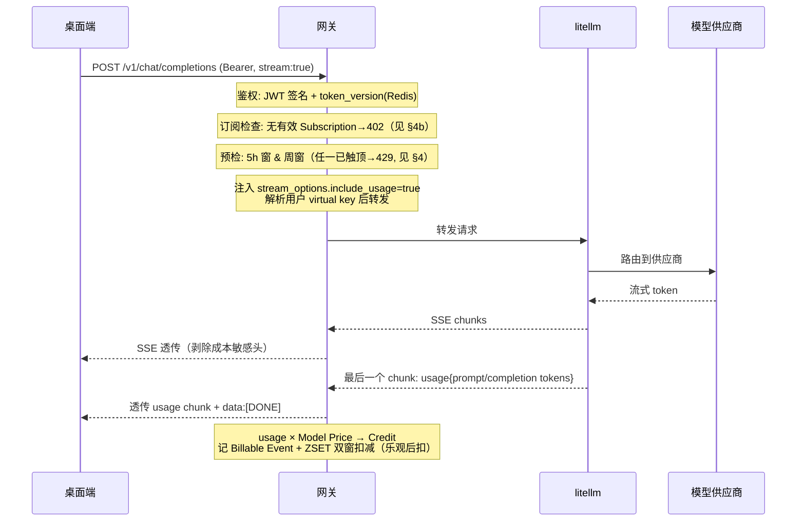

# LLM 代理流程（D1 模型列表 + D2 流式推理）—— 桌面端对接方案

桌面端 ↔ 网关 的 LLM 调用。机制决策见 ADR-0005（网关代理、自拥记账）、ADR-0008（计量与窗口强制）。

**总原则**：网关对桌面端暴露 **OpenAI 兼容**接口，自身只做「鉴权 + 窗口预检 + 转发 litellm + 计量扣减」的薄层——请求/响应/错误形态全部贴着 litellm（即 OpenAI 惯例），桌面端可直接用任意 OpenAI SDK（`base_url` 指向网关）。

```
桌面端 (OpenAI SDK, base_url=网关)
   │ Bearer <网关 access JWT>
   ▼
网关  ── 鉴权(JWT+Device) → 窗口预检 → 注入 usage 选项 → 解析用户 virtual key → 转发
   │ Bearer <该用户专属 litellm virtual key>（网关按用户签发/持有，桌面端不可见；ADR-0014）
   ▼
litellm proxy ──→ 各模型供应商
```

---

## 1. 对接约定

- **端点**：`POST /v1/chat/completions`（推理）、`GET /v1/models`（模型列表）、`POST /v1/images/generations`（图片生成）、`POST /v1/images/edits`（图片编辑，multipart）。后续可按需开 `/v1/embeddings` 等，同样代理形态。全局约定见 [api-conventions.md](./api-conventions.md)。
- **鉴权**：`Authorization: Bearer <网关 access JWT>`（同其他 API，见 auth.md）。网关换成**该用户专属的** litellm virtual key 转发（按用户 1:1 签发，归因 + 纵深防御保险丝，限额权威仍在网关窗口；ADR-0014）——**桌面端永远拿不到 litellm key**。库里 key 被 litellm 拒（401/403）时网关一次性自愈轮换并重试。
- **协议**：请求/响应体为 OpenAI 格式；流式为 SSE（`data: {...}\n\n`，终止 `data: [DONE]`）；多模态走标准 message content（image_url/base64）。
- **请求体上限**：整体请求体（含多模态 base64）≤ **25MB**；超限 ⇒ `413` + OpenAI 错误体 `code:"request_too_large"`。当前上限经 bootstrap 的 `max_upload_mb` flag 广播，桌面端可预检。
- **流式超时**：网关 chunk 间空闲 > **120s** 或单请求总时长 > **30min** ⇒ 中断（按已生成部分计费，ADR-0008）。桌面端 SSE 读超时建议 **≥130s**（略大于网关空闲，避免客户端先放弃）。
- **响应头处理**（网关侧）：
  - **剥除**上游成本敏感头：`x-litellm-response-cost`、`x-litellm-key-spend`、`x-litellm-model-api-base`、`llm_provider-*` 等
  - **保留/透传**：`x-litellm-call-id`（请求追踪用，桌面端报障时附上）
  - **网关自身追加**：触顶阻断时的窗口恢复信息（见 §4）

---

## 2. D1 · 模型列表（代理 litellm）

**`GET /v1/models`**（Bearer）—— 网关直接代理 litellm 的 `/v1/models`，返回 OpenAI 标准形态：

```ts
interface ModelList {
  object: "list";
  data: {
    id: string;        // 模型名（即 chat/completions 里 model 字段可用值）
    object: "model";   // 固定 "model"
    created?: number;  // 创建时间（Unix 秒）
    owned_by?: string; // 归属方
  }[];
}
```

- litellm 返回什么就是什么（已定：**代理而非网关自有列表**）——litellm `config.yaml` 里配置的 model 列表即桌面端可见列表。
- 模型的启用/下线通过改 litellm 配置完成，网关零改动。

---

## 3. D2 · 流式推理

### 3.1 时序



### 3.2 请求（OpenAI 标准，要点）

```ts
interface ChatRequest {
  model: string;                  // 取自 GET /v1/models 的 id
  messages: Message[];            // OpenAI 标准消息（支持多模态 content）
  stream?: boolean;               // true=SSE 流式
  stream_options?: { include_usage?: boolean };  // 网关强制注入 true，桌面端可不传
  // 其余 OpenAI 参数（temperature/max_tokens/tools/...）原样透传
}
```

### 3.3 流式响应（SSE）

- 正常 chunk：`data: {"choices":[{"delta":{"content":"..."}}],...}`
- **最后一个数据 chunk 带 usage**（因网关强制 `include_usage`）：
```json
{ "choices": [], "usage": { "prompt_tokens": 1200, "completion_tokens": 350, "total_tokens": 1550 } }
```
- 终止：`data: [DONE]`
- 桌面端无需处理计费——usage chunk 透传仅供展示，扣减由网关完成。
- **容错**：个别上游可能不返回 usage chunk（此时网关内部 tokenizer 估算兜底，§6）；桌面端展示逻辑须按「**usage chunk 可能缺失**」容错，缺失时不展示 token 数即可。

### 3.4 非流式

`stream:false` 时为普通 JSON 响应，`usage` 在响应体内，计量同理。

---

---

## 3a · 图片生成（代理 litellm）

**`POST /v1/images/generations`**（Bearer）—— 网关代理 litellm 的同名端点，OpenAI 标准形态：

```ts
interface ImageRequest {
  model: string;           // 取自 GET /v1/models 中的图片模型 id（如 dall-e-3、gpt-image-1）
  prompt: string;          // 必填，提示词
  n?: number;              // 生成张数，默认 1
  size?: string;           // 如 "1024x1024" / "1792x1024"
  quality?: "standard" | "hd";
  response_format?: "url" | "b64_json";
  // 其余 OpenAI 参数原样透传
}
```

- 响应始终为同步 JSON（无 SSE）：`{"created":..., "data":[{"url":"..."} | {"b64_json":"..."}]}`，上游什么形态网关原样回传。
- **门禁顺序与 chat 一致**：JWTAuthLLM → 订阅检查(402) → 请求体 ≤25MB(413) → 窗口预检(429) → 转发。订阅 / 体积 / 窗口任何一道拦截**绝不**到达 litellm。
- **virtual key 注入**：与 chat 同口径，按用户 1:1 签发；上游 401/403 触发一次性自愈轮换 + 重试一次。
- **错误形态**：上游错误体（参数错 / 模型不存在 / 内容策略等）原样透传 OpenAI 错误体；网关侧错误同形态。
- **窗口预检与 chat 共享**——chat 把窗口打满会同时阻断 images 请求（同账号同窗口口径一致）。
- **计量当前未写入图片用量**：图片接口无 token usage，按图片数量折算 Credit 需待图片 Model Price 接入（见 §6 / Park）。换言之，**图片请求会受窗口阻断但不会增厚窗口**——这是有意为之的占位态，等定价落地后再补。

### 3a.1 图片编辑（multipart）

**`POST /v1/images/edits`**（Bearer）—— 网关代理 litellm 的同名端点，**multipart/form-data**：

```
Content-Type: multipart/form-data; boundary=...

image    : (file)  必填；待编辑原图（PNG/WebP）。gpt-image-1 支持多张。
prompt   : (text)  必填；编辑指令。
mask     : (file)  可选；透明区指示要重绘的位置。
model    : (text)  如 gpt-image-1 / dall-e-2。
n / size / response_format / user / quality / background ...  其余 OpenAI 字段原样透传。
```

- **关键差异（vs. generations）**：multipart 请求体含二进制图字节，网关把上游 `Content-Type`（含 `boundary=...`）**原样**透传给 litellm；若被改写则上游解多部分失败。
- 响应形态与 generations 完全一致：同步 JSON `{"created":..., "data":[{"url":"..."} | {"b64_json":"..."}]}`。
- 门禁顺序、virtual key 注入、401/403 自愈轮换、窗口预检共享、计量 park 一律同 §3a。25MB 请求体上限对带图请求同样适用——超大图需客户端先裁剪/压缩。

---

## 4. 触顶阻断（429，贴 litellm/OpenAI 惯例）

窗口预检失败时，网关返回 **HTTP 429 + OpenAI 兼容错误体**——与 litellm 自身的 RateLimitError 同形态，桌面端 SDK 一套逻辑处理两种来源：

```json
{
  "error": {
    "message": "Usage window cap reached. 5h window resets at 2026-06-11T18:00:00Z.",
    "type": "rate_limit_error",
    "code": "usage_window_exceeded"
  }
}
```

附加响应头（网关追加，告知恢复时间）：

| 头 | 含义 |
|---|---|
| `Retry-After` | 距最近一个窗口滚动恢复的秒数 |
| `X-Window-5h-Reset` | 5h 窗恢复时间（Unix 秒；触顶才出现） |
| `X-Window-Week-Reset` | 周窗恢复时间（Unix 秒；触顶才出现） |

- `code: "usage_window_exceeded"` 用于区分「网关窗口触顶」与上游透传的供应商限流（后者 code 不同）。
- **没有独立用量查询端点**（已定）：桌面端通过 429 + 上述头得知触顶与恢复时间。

---

## 4b. 无有效订阅阻断（402）

每个 Plan 都付费、无免费层（CONTEXT）。已登录但**无有效 Subscription**（从未订阅 / 已过期）调 `/v1/*` ⇒ 在窗口预检**之前**返回 `402` + OpenAI 错误体：

```json
{
  "error": {
    "message": "No active subscription. Subscribe to a plan to use the model.",
    "type": "subscription_error",
    "code": "no_active_subscription"
  }
}
```

桌面端按 `code: "no_active_subscription"` 跳转订阅流程。
> 订阅入口 / Plan 数值 / 定价 parked（见记忆），此处只定错误契约。

---

## 5. 错误处理（桌面端必须处理）

litellm 错误（OpenAI 形态 `{"error":{message,type,param,code}}`）原样透传；网关自身错误同形态。

| 状态 | 来源 | 含义 | 桌面端处理 |
|---|---|---|---|
| `401` | 网关 | access token 失效 | 刷新 token / 重登（auth.md），重试 |
| `403` | 网关 | Device 被吊销 | 重新登录 |
| `402` + `no_active_subscription` | 网关 | 无有效订阅（未订阅/过期） | 引导用户订阅（见 §4b） |
| `429` + `usage_window_exceeded` | 网关 | 用量窗口触顶 | 展示恢复时间（`Retry-After`/`X-Window-*-Reset`），到点恢复 |
| `429`（其他 code） | litellm 透传 | 上游供应商限流 | 按 `Retry-After` 退避重试 |
| `400` | litellm 透传 | 参数错 / 超上下文窗 / 内容策略 | 提示用户（如裁剪上下文） |
| `413` + `request_too_large` | 网关 | 请求体超 25MB | 裁剪附件 / 分批，重发 |
| `408` / `503` | litellm 透传 | 超时 / 上游不可用 | 退避重试 |
| `500` | 任一 | 内部错误 | 重试一次后报错；附 `x-litellm-call-id` 报障 |
| 流中断 | — | 网络断开 | 已生成部分按实扣费（ADR-0008）；桌面端可重发 |

---

## 6. 网关侧计量要点（非桌面端契约，备忘）

- **乐观放行**：预检只看窗口是否已触顶，未触顶即放行，结束后按实际 usage 扣减——单请求可超额（ADR-0008）。
- **计量来源**：强制 `include_usage` 的最终 usage chunk；缺失时 tokenizer 估算兜底。litellm 的 `x-litellm-response-cost`（美元成本）可作内部对账参考，**不作为扣减依据**（Credit 折算依托 Model Price，待产品文档定价）。
- **窗口存储**：Redis ZSET（ts → credits），滚动求和 + 原子扣减。
- 硬错误（无任何 usage）不扣费；部分生成按实扣。

## Park / 待定

- **窗口上限数值与 Model Price 定价**——等产品文档（已 park，见记忆）。
- **图片生成的 Credit 计价**——`/v1/images/generations`、`/v1/images/edits` 已开通转发，但 per-image Credit 折算尚未接入（见 §3a / §3a.1），等图片定价落地后在 `MeteringService` 加 image-pricing 写入。
- `/v1/embeddings`、`/v1/audio/*` 等其他 litellm 端点是否开放——按桌面端需求逐个加。
