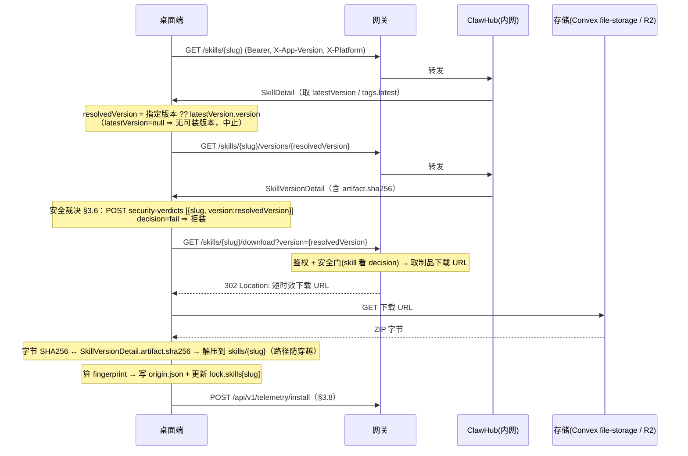

# Skill / Plugin 生命周期 —— 桌面端对接方案

面向**桌面端 Agent 开发**：完整生命周期 + 每一步的交互数据结构。桌面端统一对接网关 `/api/v1/*`，注册中心（fork 裁剪版 ClawHub）在网关后内网、桌面端无感。

> 注册中心后端侧（fork 裁剪范围、自托管、Convex/R2）见 [clawhub-integration.md](./clawhub-integration.md)；鉴权见 [auth.md](./auth.md)；宿主 App 自更新见 [distribution.md](./distribution.md)。

---

## 0. 对接概览

- **传输**：HTTPS + JSON；下载为二进制（ZIP/tgz）。
- **鉴权**：每个请求带 `Authorization: Bearer <accessJWT>`（见 auth.md）。网关鉴权后转发，桌面端不直接接触 ClawHub。
- **客户端标识头**：每个请求带 `X-App-Version`（桌面 App 版本）、`X-Platform`（如 `darwin-arm64`），用于 plugin 兼容过滤。
- **权威已装状态**：由桌面端在本地 `.vulture/` 维护（§1）；升级检测靠**内容指纹**而非单纯版本号。
- **基址**：下文端点路径省略基址，实际为 `https://<gateway>/api/v1/...`。（少数处如 `/api/v1/telemetry/install` 写了**全路径**，即基址本身、不再叠加。）完整端点总表 / 错误矩阵 / 公共头见 [api-conventions.md](./api-conventions.md)。

**桌面端要实现的能力（总览）**
1. 维护本地状态文件 `.vulture/lock.json` + 每包 `.vulture/origin.json`（§1）
2. 实现指纹算法（§1.3）——安装/更新都要用
3. 列表展示（skill 列表 / plugin 列表，无搜索）/ 详情（§3.1–3.2）
4. 安装：解析→下载→校验完整性→解压→写状态（§3.3）
5. 更新：算本地指纹→`/resolve`→判定→下载（§3.4）
6. pin/unpin/uninstall（纯本地，§3.5）
7. 安装前/后安全裁决查询（§3.6）
8. 兼容门禁解读（§3.7）、安装遥测上报（§3.8）
9. 错误与状态码处理（§4）

---

## 1. 本地状态模型（桌面端实现）

### 1.1 目录布局

```
<workdir>/
├── skills/
│   └── <slug>/                 # 解压后的 skill 内容（被模型读取）
│       └── .vulture/
│           └── origin.json     # 每个已装 skill 一份
├── plugins/
│   └── <name>/                 # 解压后的 plugin 内容（装进客户端进程的代码/二进制）
│       └── .vulture/
│           └── origin.json     # 每个已装 plugin 一份
└── .vulture/
    └── lock.json               # workspace 级，全量已装清单（skills + plugins）+ pin
```

### 1.2 状态文件结构

**`.vulture/lock.json`**（workspace 级，权威已装清单）
```ts
interface LockFile {
  version: 1;                   // lockfile 格式版本，固定为 1
  skills: Record<string /*slug*/, {   // 已装 skill：slug → 安装记录
    version: string;            // 已装版本（semver；安装流程总写具体版本）
    installedAt: number;        // 安装时间戳（Unix 毫秒）
    pinned?: true;              // 是否锁定版本（仅 pin 后存在）
    pinReason?: string;         // 锁定原因（仅 pin --reason 时存在）
  }>;
  plugins?: Record<string /*name*/, {  // 已装 plugin：name → 安装记录（与 skill 分开，按版本号判更新）
    version: string;            // 已装版本（semver）
    artifactSha256: string;     // 已装制品归档 sha256（下载完整性校验用；不参与更新判定）
    installedAt: number;        // 安装时间戳（Unix 毫秒）
    pinned?: true;              // 是否锁定版本
    pinReason?: string;         // 锁定原因
  }>;
}
```
```json
{ "version": 1,
  "skills": {
    "gifgrep": { "version": "1.2.0", "installedAt": 1733700000000 },
    "tariff-calc": { "version": "2.1.0", "installedAt": 1733700001000, "pinned": true, "pinReason": "锁定到 2.1.0" }
  },
  "plugins": {
    "@vulture/notion-sync": { "version": "0.4.1", "artifactSha256": "ab12…", "installedAt": 1733700002000 }
  }
}
```

**`<slug>/.vulture/origin.json`**（每个已装制品一份）
```ts
interface OriginFile {
  version: 1;                  // origin 格式版本，固定为 1
  registry: string;            // 安装来源的 registry 基址（用于校验/重装）
  slug: string;                // 制品唯一标识
  installedVersion: string;    // 已装版本（semver）
  installedAt: number;         // 安装时间戳（Unix 毫秒）
  fingerprint?: string;        // 安装时内容指纹基线（64 位 hex）：resolve 回 match==null 时辨因（==磁盘 ⇒ 版本被取代/下架，≠ ⇒ 本地被改动），§3.4
}
```
读取校验：`version!==1` 或缺 `registry/installedVersion`、缺标识（skill 查 `slug`、**plugin 变体改判 `name`**）、`installedAt` 非有限数 ⇒ 视为无效（重装）。

> **Plugin 变体**：plugin 的 `origin.json` 用 `name` 替代 `slug`、用 `artifactSha256` 替代 `fingerprint`（plugin 走版本比较、无指纹），其余字段一致；落 `plugins/<name>/.vulture/origin.json`。

### 1.3 指纹算法（**仅 skill** 的更新检测基础，CLI 与服务端逐字一致）

> 仅 **skill** 用内容指纹判更新；**plugin** 不算指纹，按版本号判定（§3.4 末「Plugin 升级」）。

```
function fingerprint(dir):
  files = 收集 dir 下文本文件
          排除: .git/  node_modules/  .vulture/  任何点开头路径段
          遵守: .gitignore / .vultureignore
  entries = []
  for f in files:
      entries.push({ path: f 相对路径, sha256: SHA256(f 原始字节) 的 hex })
  entries = entries.filter(e => e.path && e.sha256)
                   .sort((a,b) => a.path.localeCompare(b.path))
  payload = entries.map(e => `${e.path}:${e.sha256}`).join("\n")
  return SHA256(payload) 的 hex     // 64 位
```
> `.vulture/` 被排除 ⇒ 写 origin.json **不会**改变指纹。

---

## 2. 交互数据结构总览

通用类型：

```ts
// 游标分页容器
interface Page<T> {
  items: T[];                  // 当前页数据
  nextCursor: string | null;   // 下一页游标；null 表示已到末页
}

// 错误体（HTTP 4xx/5xx 时返回）
interface ApiError {
  error: string;               // 错误码（机器可读，如 "invalid_grant"）
  message?: string;            // 错误描述（人类可读，可选）
}

// 制品所有者
interface Owner {
  handle: string;              // 所有者唯一 handle
  displayName?: string;        // 展示名
  image?: string | null;       // 头像 URL
}

// 版本内文件清单项
interface VersionFile {
  path: string;                // 文件在制品内的相对路径
  size: number;                // 文件字节数
  sha256: string;              // 文件内容 SHA256（hex），完整性 / 指纹用
  contentType?: string;        // MIME 类型（可选）
}

// 兼容性元数据（plugin）
interface Compatibility {
  pluginApiRange?: string;          // 兼容的 plugin API 版本范围，如 ">=2026.3.24"
  builtWithOpenClawVersion?: string;// 构建时所用的桌面 Agent 运行时版本
  pluginSdkVersion?: string;        // 构建所用 plugin SDK 版本
  minGatewayVersion?: string;       // 要求的最低网关版本
  minAppVersion?: string;           // 要求的最低桌面 App 版本（我们新增）
  hostTargets?: string[];           // 兼容的宿主平台/架构（如 darwin-arm64）；与 X-Platform 比对
}
```

各端点的请求/响应结构见 §3 各阶段。

---

## 3. 完整生命周期（桌面端视角）

> 所有 `GET` 列表/详情/解析/安全为只读，`X-App-Version`/`X-Platform` 头按需过滤；写操作（发布/重命名/删除）为运营内网用，桌面端不调用。

### 3.1 技能列表 / 插件列表（直接展示，无搜索）

> **不提供搜索**（向量与关键字均不做）。桌面端直接拉取列表，靠 `sort` 排序 + 游标分页 + filter（family/channel/平台）浏览。

**Skill 列表 `GET /skills?limit=&cursor=&sort=`**（`sort ∈ updated|downloads|stars|installsCurrent|trending`）
```ts
interface SkillListItem {
  slug: string;                // 唯一标识（URL 用）
  displayName: string;         // 展示名
  summary?: string;            // 一句话简介
  tags: Record<string /*tag*/, string /*version*/>;   // tag → 版本号映射；tags.latest 即最新版本
  createdAt: number;           // 创建时间（Unix 毫秒）
  updatedAt: number;           // 最近更新时间（Unix 毫秒）
  latestVersion: {             // 最新版本摘要；无版本时为 null
    version: string;           // 版本号（semver）
    createdAt: number;         // 该版本发布时间
    changelog: string;         // 更新日志
    license?: string;          // 许可证
  } | null;
  metadata: {                  // 平台元数据；无则 null
    os?: string[];             // 支持的 OS
    systems?: string[];        // 支持的系统 / 架构
  } | null;
}
// 响应: Page<SkillListItem>
```

**Plugin 列表 `GET /plugins`**（query 同上 + `family`、`channel`、`executesCode`）
```ts
interface PluginListItem {
  name: string;                // 唯一标识（包名）
  displayName: string;         // 展示名
  summary?: string;            // 一句话简介
  family: "code-plugin" | "bundle-plugin";        // 类型：执行代码的插件 / 宿主 bundle
  channel: "official" | "community" | "private";  // 渠道
  isOfficial: boolean;         // 是否官方
  latestVersion?: string;      // 最新版本号
  capabilityTags?: string[];   // 能力标签（如 executes-code、host:darwin-arm64）
  executesCode?: boolean;      // 是否执行代码
  verificationTier?: "structural" | "source-linked" | "provenance-verified" | "rebuild-verified";  // 来源验证层级
  scanStatus?: "clean" | "suspicious" | "malicious" | "pending" | "not-run";   // 安全扫描状态
}
// 响应: Page<PluginListItem>
```
> 网关按 `X-Platform`/`X-App-Version` 过滤掉不兼容的 plugin（见 §3.7）。

### 3.2 详情 & 版本

**Skill 详情 `GET /skills/{slug}`**
```ts
interface SkillDetail {
  skill: {
    slug: string;              // 唯一标识
    displayName: string;       // 展示名
    summary?: string;          // 简介
    tags: Record<string,string>;  // tag → 版本号；tags.latest 为最新
    createdAt: number;         // 创建时间
    updatedAt: number;         // 更新时间
  };
  latestVersion: { version: string; createdAt: number; changelog: string; license?: string } | null;  // 最新版本摘要（字段为列表项 latestVersion 的超集）
  metadata: { os?: string[]; systems?: string[] } | null;   // 平台元数据
}
```

**版本历史 `GET /skills/{slug}/versions?limit=&cursor=`** → `Page<{ version; createdAt; changelog; changelogSource }>`

**指定版本 `GET /skills/{slug}/versions/{version}`**
```ts
interface SkillVersionDetail {
  skill: {
    slug: string;              // 制品标识
    displayName: string;       // 展示名
  };
  version: {
    version: string;           // 版本号（semver）
    createdAt: number;         // 发布时间
    changelog: string;         // 更新日志
    changelogSource?: "auto" | "user";  // 日志来源：自动生成 / 用户填写
    files: VersionFile[];      // 该版本文件清单（含每文件 sha256）
    artifact: {                // 下载归档（ZIP）信息
      sha256: string;          // 归档 SHA256（下载完整性校验用）
      size: number;            // 字节数
    };
  };
}
```

**Plugin 详情 `GET /plugins/{name}`**（升级比较用：取 `latestVersion.version`）
```ts
interface PluginDetail {
  package: {
    name: string;              // 包名（唯一标识）
    displayName: string;       // 展示名
    family: "code-plugin" | "bundle-plugin";        // 类型
    channel: "official" | "community" | "private";  // 渠道
    isOfficial: boolean;       // 是否官方
  };
  latestVersion: {             // 最新版本摘要；无版本时为 null
    version: string;           // 最新版本号（= distTags.latest）——升级比较用
    createdAt: number;         // 发布时间
    changelog: string;         // 更新日志
  } | null;
  compatibility?: Compatibility;  // 最新版本兼容性元数据（装前自检，见 §3.7）
}
```

**Plugin 指定版本 `GET /plugins/{name}/versions/{version}`**
```ts
interface PluginVersionDetail {
  package: {
    name: string;              // 包名
    displayName: string;       // 展示名
    family: string;            // 类型：code-plugin / bundle-plugin
  };
  version: {
    version: string;           // 版本号（semver）
    createdAt: number;         // 发布时间
    changelog: string;         // 更新日志
    distTags: string[];        // npm 风格 tag 数组（含 "latest"）
    files: VersionFile[];      // 文件清单
    compatibility?: Compatibility;       // 兼容性元数据（装前自检，见 §3.7）
    capabilities?: Record<string, unknown>;  // 能力清单（工具 / 命令 / hook 等）
    artifact?: {               // 制品归档信息
      kind: "legacy-zip" | "npm-pack";  // 归档形态
      sha256: string;          // 归档 SHA256
      size: number;            // 字节数
    };
    sha256hash?: string;       // 整版本内容 hash（去重用）
  };
}
```

### 3.3 安装 Install



**下载 `GET /skills/{slug}/download?version=`**（缺 version 取 latest）
- 鉴权 + 安全门（**skill** 看 security-verdicts `decision=fail`、**plugin** 看 `PluginTrust.blockedFromDownload`，命中 ⇒ `403`、不签发 URL）通过后，返回 **`302`**，`Location` 头携带**短时效制品下载 URL**（Convex file-storage 签发，R2 backed；见 clawhub-integration.md）。
- 桌面端跟随 302 **直连存储**下载 `application/zip` 字节，不经网关。
- **完整性**：期望 sha256 取自版本详情（skill=`version.artifact.sha256`，plugin=`artifact.sha256`）；下载后对字节算 SHA256 比对，不符则丢弃重试。
- 预签名 URL **过期 / 403** ⇒ 重新请求本端点换新 URL。

**Plugin 下载**：下载前先 `GET /plugins/{name}/versions/{version}/security`，`blockedFromDownload=true` 即拒装（与 skill 的 security-verdicts 对称）。按版本详情 `artifact.kind` 选端点——`legacy-zip` 走 `GET /plugins/{name}/download?version=`，`npm-pack` 走 `GET /plugins/{name}/versions/{version}/artifact/download`（取 `.tgz`）；两者同样 `302` 跳短时效下载 URL。

**写状态**（成功安装后）：
```ts
origin.json = { version:1, registry, slug, installedVersion: resolvedVersion, installedAt: Date.now(), fingerprint: fingerprint(skills/{slug}) }
lock.skills[slug] = { version: resolvedVersion, installedAt: Date.now() }   // 保留已有 pinned/pinReason
```
**约束**：目标目录已存在且非 `--force` → 拒绝；`lock.skills[slug].pinned` → 拒绝（要求先 unpin）。

**Plugin 写状态**（成功安装后，解压到 `plugins/<name>/`）：
```ts
origin.json = { version:1, registry, name, installedVersion: resolvedVersion, artifactSha256, installedAt: Date.now() }   // plugin 变体：name + artifactSha256，无 fingerprint
lock.plugins[name] = { version: resolvedVersion, artifactSha256, installedAt: Date.now() }   // 保留已有 pinned/pinReason
```

> **显式指定版本 ⇒ 自动 pin**：安装时若**显式指定了版本**（而非取 latest），写 `pinned:true` + `pinReason:"显式安装 <version>"`，使 `update`/`update --all` 不会把它顶到 latest；`unpin` 后恢复跟随最新。

### 3.4 升级检查 & 更新（指纹法）⭐

**`GET /skills/{slug}/resolve?hash={localFingerprint}`** —— 把本地指纹映射到已发布版本
```ts
interface ResolveResponse {
  slug: string;                              // 查询的制品标识
  match: { version: string } | null;         // 与本地指纹完全一致的已发布版本；null=本地被改动过 / 无匹配
  latestVersion: { version: string } | null; // 当前最新可见版本；与 match 比较判断是否需更新
}
```

判定逻辑（桌面端）：
```
local = fingerprint(skills/{slug})
{ match, latestVersion } = GET /skills/{slug}/resolve?hash=local
if latestVersion == null:                          无可见版本（全部软删）→ 提示已下架，不动
elif match == null && !force:                      本地不匹配任何已发布版本 → 提示/确认，仅 --force 覆盖为 latest
                                                   （借 origin.fingerprint 辨因：存在且 ==fingerprint(磁盘) ⇒ 版本被取代/下架；≠ ⇒ 自安装后被改动）
elif match && semver.gte(match.version, latestVersion.version):   已最新，不动
else:                                              有新版（或 --force 覆盖）→ 原子更新（见下）
```
**原子更新**（skill / plugin 通用）：下载到**临时目录** → 取版本详情校验 `artifact.sha256` → 通过后**原子替换**（rename）目标目录 → 重写 origin + lock。任何一步失败 **保留原内容、不删**——杜绝半成品 / 用户内容丢失。
更新后：`origin.json` 保留原 `registry/installedAt`，更新 `installedVersion` + 重算 `fingerprint`；同步 `lock.json`。

**Plugin 升级（版本比较，非指纹）**：plugin 是不可变版本化制品，不算内容指纹。
```
local = lock.plugins[name].version
{ latestVersion } = GET /plugins/{name}            // PluginDetail，latestVersion: {version,…} | null
if latestVersion == null:                          无可见版本 → 不动
elif semver.gte(local, latestVersion.version):     已最新，不动
else:                                              有新版 → 取 PluginVersionDetail 拿 artifact.sha256（PluginDetail 不含）→ 原子更新（同上）：下载 .tgz 到临时 → 校验 sha256 → 原子替换 plugins/<name> → 更新 lock.plugins[name]
```
`update --all`：遍历 lock.skills（指纹法）+ lock.plugins（版本比较），两者均**跳过 pinned**。

### 3.5 pin / unpin / uninstall（纯本地，不触网）

```
pin <slug> [--reason r]:  lock.skills[slug] = { ...existing, pinned:true, pinReason:r }
unpin <slug>:             删除 lock.skills[slug] 的 pinned/pinReason
uninstall <slug>:         rm -rf skills/{slug}  →  成功后 delete lock.skills[slug]  →  写回 lock.json
                          （rm 失败则 lock 不动、可重试；**绝不先删 lock**，避免孤儿目录）
（plugin 同理：pin/unpin/uninstall 作用于 lock.plugins[name] 与 plugins/<name>/）
```
pinned 效果：`install`/`update <slug>` 拒绝；`update --all` 静默跳过。

### 3.6 安全裁决查询（安装前/后）

**批量裁决 `POST /skills/-/security-verdicts`**（1–100 项）
```ts
// 请求
{ items: { slug: string; version: string }[] }
// 响应
interface SecurityVerdictResponse {
  schema: "clawhub.skill.security-verdicts.v1";   // 响应 schema 标识
  items: {
    ok: boolean;                 // 该项是否查询成功
    decision: "pass" | "fail";   // 放行 / 拦截
    reasons: string[];           // 拦截原因码
    requestedSlug: string;       // 请求的 slug
    slug?: string;               // 实际解析到的 slug
    displayName?: string;        // 展示名
    requestedVersion: string;    // 请求的版本
    version?: string;            // 实际解析到的版本
    security: SecurityStatus | null;   // 安全详情；查询失败为 null
    error?: { code: string; message: string };   // ok=false 时的错误
  }[];
}
interface SecurityStatus {
  status: "clean" | "suspicious" | "malicious" | "pending";   // 安全状态
  passed: boolean;             // 是否通过（可安全安装）
  signals?: {                  // 各扫描信号明细
    staticScan?: { status: string; reasonCodes: string[] };   // 确定性静态扫描结果
  };
}
```
用途：桌面端**安装前**批量查 `decision`，`fail`/`malicious` 拒装；**安装后**定期刷新已装清单状态（被下架/判恶意则提示卸载）。`security.passed`/`status` 仅供展示与日志，**放行一律以 `decision` 为准**。

**Plugin 安装阻断 `GET /plugins/{name}/versions/{version}/security`**
```ts
interface PluginTrust {
  package: { name: string };               // 包名
  release: {
    version: string;                       // 版本号
    artifactSha256: string;                // 制品 SHA256
  };
  trust: {
    scanStatus: "clean" | "suspicious" | "malicious" | "pending" | "not-run";  // 扫描状态
    moderationState?: "approved" | "quarantined" | "revoked";   // 运营人工裁决
    blockedFromDownload: boolean;          // true=禁止下载/安装（权威阻断信号）
    reasons: string[];                     // 阻断原因码（如 scan:malicious、manual:quarantined）
    pending?: boolean;                     // 是否仍在扫描中
    stale?: boolean;                       // 扫描结果是否过期
  };
}
```

> **批量装 plugin**：v1 无 plugin 批量安全端点，逐个 `GET /plugins/{name}/versions/{version}/security` 查询（skill 才有批量 `POST /skills/-/security-verdicts`）。

> **扫描中（pending）策略**（v1 保守）：未完成扫描的版本**不放行**——skill 返回 `decision=fail`（`reasons` 含 `scan:pending`、`security.status=pending`），plugin 返回 `blockedFromDownload=true`（`pending=true`）。桌面端据 `pending` 标志当作「**稍后重试**」展示，而非「恶意拒装」。两条路径别混：**查裁决端点**恒 `200`、pending 体现在 body（`decision`/`status`）；若**跳过裁决直接下载**未就绪版本，下载端点以 `423/409` 挡（§4）。

### 3.7 兼容门禁（桌面端解读）

- 请求带 `X-App-Version` + `X-Platform`，网关据此过滤列表/详情中不兼容的 plugin。
- plugin 详情的 `compatibility` 字段桌面端**安装前自检**：
  - `minAppVersion` > 当前 App 版本 ⇒ 不可装，提示升级 App
  - `minGatewayVersion`：由**网关侧**强制（网关知道自身版本，据此过滤/拒绝不兼容 plugin）；客户端如需预检可用 bootstrap 的 `gateway_version`
  - `pluginApiRange` 不含当前 plugin API 版本 ⇒ 不可装
  - `hostTargets` / `X-Platform` 不匹配 ⇒ 不在列表出现
- skill 的 `metadata.os/systems` 同理做平台过滤。

### 3.8 安装遥测（保留）

**`POST /api/v1/telemetry/install`**
```ts
// 请求
interface TelemetryReport {
  roots: {                       // 一个或多个安装根
    rootId: string;              // 安装根标识 = SHA256(绝对路径)，隐私哈希、不暴露真实路径
    label: string;               // 脱敏的可读标签
    skills: {                    // 该根下已装 skill
      slug: string;              // 制品标识
      version: string;           // 已装版本
    }[];
    plugins: {                   // 该根下已装 plugin（驱动 plugin 列表 installsCurrent）
      name: string;              // 包名
      version: string;           // 已装版本
    }[];
  }[];
}
// 响应: { ok: true }
```
- best-effort，失败静默；`VULTURE_DISABLE_TELEMETRY=1` 可关。
- 服务端按 root 做**状态快照对账**（非自增），维护 `installsCurrent`/`installsAllTime`。

### 3.9 宿主 App 自更新

App 二进制自更新**不走 ClawHub**，见 [distribution.md](./distribution.md)（`GET /api/v1/app/latest`）。

---

## 4. 错误与状态码（桌面端必须处理）

| 状态 | 含义 | 桌面端处理 |
|---|---|---|
| `401` | access token 失效 | 触发刷新/重登（见 auth.md），重试 |
| `403`（`error`=`device_revoked`/`unauthorized`） | Device 被吊销 / 无权限 | 重新登录 |
| `403`（`error`=`blocked`/`scan:*`） | 安全阻断：`decision=fail` / `blockedFromDownload` | **拒装、不要重登**——按 `ApiError.error` 分流，否则会重登死循环 + 误报原因 |
| `400` | 参数错（如 resolve 的 hash 非 64hex） | 修正请求 |
| `404` | slug/package 不存在 | 提示不存在 |
| `410` | 版本已软删除 | 提示已下架，触发卸载/换版本 |
| `423`/`409` | 扫描中（pending）/ 质量不达标（owner 可见态） | 提示稍后重试（区别于 malicious 的 `403` 永久阻断） |
| `429` | 限流（带 `Retry-After`） | 退避重试 |
| 完整性校验失败 | sha256 不符 | 丢弃重下 |

---

## 5. 桌面端实现 checklist

- [ ] `.vulture/lock.json` + 每包 `.vulture/origin.json` 读写
- [ ] 指纹算法（§1.3）与服务端逐字一致
- [ ] 列表/详情/版本拉取（游标分页，无搜索）
- [ ] 安装：security-verdicts 检查 → 下载（302→存储直连）→ **完整性校验**（字节 sha256 比对版本详情）→ 解压（路径防穿越）→ 写状态 → 遥测
- [ ] Skill 更新：本地指纹 → `/skills/{slug}/resolve` → 判定（已最新/本地改动/有新版）
- [ ] Plugin 更新：`GET /plugins/{name}` 取最新版本 → 与 `lock.plugins[name].version` 版本比较（非指纹）
- [ ] pin/unpin/uninstall 本地语义（skill=slug/`skills/`，plugin=name/`plugins/`）
- [ ] 安全：skill 批量 `security-verdicts`、plugin 单查 `/plugins/{name}/versions/{version}/security`（PluginTrust）；安装前查、安装后定期刷新
- [ ] compat 自检（minAppVersion/pluginApiRange/平台；minGatewayVersion 由**网关侧**强制）
- [ ] 错误与状态码处理（§4）
- [ ] `X-App-Version`/`X-Platform` 头、`Authorization: Bearer`
